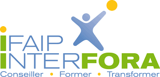
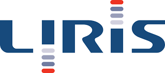
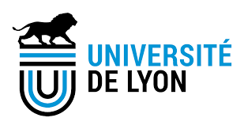
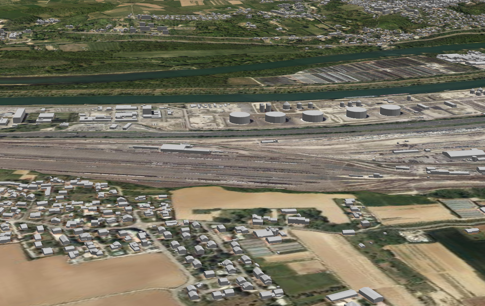

# TIGA-Webdocumentaire

<p align="center">
  
  
  
</p>

***

## Introduction au projet « Derrière les fumées »

« Derrière les fumées » est un jumeau digital du
[couloir de la chimie](https://fr.wikipedia.org/wiki/Vall%C3%A9e_de_la_chimie),
de l'unité urbaine de Lyon, qui invite à aller à la rencontre des familles et
des acteurs économiques et publics, qui vivent, se forment, et travaillent dans
la vallée.
Il désenchevêtre tous ces tuyaux entremêlés et donne du sens à ces produits
mystérieux qui sortent tous les jours de ces usines. A quoi cela peut servir ?
Où est-ce que je les rencontre au quotidien ? Pourquoi la plupart des maux de
tête du monde sont soignés grâce à la vallée de la chimie ? Au travers d’un
web documentaire gamifié et participatif, les acteurs du territoire, qu’ils
soient citoyens usagers ou habitants pourront se forger leur propre opinion,
participer au débat public et dissiper leur propre écran de fumée.
Ce jeu documentaire, dans lequel tout est réel, amène les participants,
au travers d’une enquête interactive, à confronter l’ensemble de leurs points
de vue pour mesurer les enjeux, l’engagement responsable de la vallée et
l’impact de ces usines sur nos vies au quotidien.
Pour entrer en « mode action », les spectateurs sont invités à voter, à
soumettre aux votes et aux avis des autres joueurs des actions concrètes pour faire évoluer les pratiques, pour mieux connaître le territoire, pour mieux se comprendre et ainsi devenir acteurs du territoire.

***

## Objectifs du projet

* Découvrir le couloir de la chimie autrement, avec la vision humaine des acteurs du territoire.
* Donner à voir le rayonnement et l’attractivité du territoire et des métiers.
* Favoriser la rencontre des acteurs pour créer des synergies, du développement économique, écologique et du lien social.
* Permettre à chaque citoyen de participer au débat public.
* Proposer une documentation en continu et diachronique de la vallée de la chimie.

Ce web-documentaire interactif est composé de deux parties :

* Une première partie, qui correspond à une
  [web série](https://fr.wikipedia.org/wiki/Web-s%C3%A9rie), où chaque épisode
  aborde un thème spécifique de la vallée de la chimie; le premier épisode
  est ainsi consacré à l'emploi et la formation.
* Un deuxième partie, au format d'une carte interactive de la vallée, où
  différents éléments sont déposés sur des points clefs de l'industrie. Cela
  permet de proposer une déambulation plus ludique de cette zone afin de mieux
  comprendre la configuration de ce territoire.

***

### Les épisodes du web-documentaire (partenaire [Interfora](https://www.interfora-ifaip.fr/))

Chaque épisode de la web-série est composé de plusieurs formats de média.
Les partenaires du projet ont souhaité impliquer au maximum l'utilisateur et
rendre la visualisation plus dynamique.
Les vidéos immersives
([en 360°](https://fr.wikipedia.org/wiki/Vid%C3%A9o_immersive)) ou des interviews contradictoires ont été produites par le partenaire
[Interfora](https://www.interfora-ifaip.fr/)
grâce au moteur de jeu
[Unity](https://fr.wikipedia.org/wiki/Unity_(moteur_de_jeu)).

***

### La maquette numérique (partenaire [Liris](https://liris.cnrs.fr/))

La carte interactive représente une grande partie de la vallée de la chimie
avec en modélisation 3D les communes de

* [Saint-fons](https://fr.wikipedia.org/wiki/Saint-Fons),
* [Feyzin](https://fr.wikipedia.org/wiki/Feyzin),
* [Irigny](https://fr.wikipedia.org/wiki/Irigny),
* Lyon 7,
* Pierre-Bénite,
* Grigny,
* Solaize,
* Vernaison et
* Givors.
Cette modélisation est générée à partir des données CityGML du
[DataGrandLyon](https://data.grandlyon.com/jeux-de-donnees/maquettes-3d-texturees-2018-communes-metropole-lyon/donnees)
et transformée à l'aide de la librairie
[py3dtilers](https://github.com/VCityTeam/py3dtilers)
qui permet produire des données au format
[3DTiles](https://github.com/CesiumGS/3d-tiles/blob/main/README.md)
(format de données géospatiales optimisé pour les applications web).

<p align="center">
  
</p>

#### Documentation technique de la maquette numérique

Cette maquette repose sur l'ensemble de composants logiciels
[UD-SV](https://github.com/VCityTeam/UD-SV)
(Urban Data Services and Vizualisation), et sa méthodologie d'intégration
associée, qui permet de réaliser une visualisation avancée de données urbaines.
La maquette numérique de la vallée de la vallée de la chimie utilise ainsi
les composants suivants :

* [Tutoriel](https://github.com/VCityTeam/UD-Viz/blob/aecb5e71d17532af8d25b21c6a08addb585acc57/docs/static/Doc/User/ContributeData.md) : Documentation d'usage général d'UD-Viz.
* [3DTiles](https://github.com/VCityTeam/UD-Viz/blob/master/src/Components/3DTiles/Docs/TilesManager.md) : integration/visualisation de données 3DTiles dans une scène 3D à l'aide la bibliothèque [itowns](http://www.itowns-project.org/).
* [Geojson layer](https://github.com/VCityTeam/UD-Demo-DatAgora-Vegetalisation-PartDieu/blob/master/ud-viz-context/BaseDemo.js#L664) :
  Visualisation de couches de données urbaines 2D en format [GeoJson](https://fr.wikipedia.org/wiki/GeoJSON).
* [Pins visualizer](doc/PinsDoc.md) : Element interactif 3D disposé dans la scène pour donner plus de détails sur des points d'intérêt.
* [Compass](doc/PinsDoc.md) : Boussole permettant un repérage dans la scène.

#### Installation de la maquette numérique sur un poste de travail

Ouvrez une
[invite de commandes](https://fr.wikipedia.org/wiki/Cmd)
puis lancez les lignes suivantes :

```bash
git clone https://github.com/VCityTeam/UD-Demo-TIGA-Webdoc-ChemistryValley.git
npm install
npm run debug     
```

Ensuite utilisez un navigateur quelconque pour ouvrir l'
[URL](https://fr.wikipedia.org/wiki/Uniform_Resource_Locator) suivante
`http://localhost:8000/`.

Ce démonstrateur de la maquette numérique peut également être lancé

* grâce au conteneur docker suivant [Docker FIXME]().
* en ligne avec l'
  [URL](https://fr.wikipedia.org/wiki/Uniform_Resource_Locator)
  suivante :
  <https://www.derrierelesfumees.com/_Contenusdlf/Carte/index.html>

***

## Atelier maquette hybride

Afin d'effectuer un premier essai de médiation hybride, et dans le cadre de la
fête de la science, une maquette Lego de la vallée de la chimie a été réalisée.
Cette maquette tangible, basée sur les données ouvertes du
[grand lyon](https://data.grandlyon.com/jeux-de-donnees/maquettes-3d-texturees-2018-communes-metropole-lyon/donnees)
et prenant comme emprise la raffinerie de Feyzin),
sert de support de projection/intégration au  web-documentaire.

La maquette a été réalisée

* grâce au [logiciel legonizer](https://github.com/VCityTeam/UD-Legonizer),
* est constituée d'environ 330 briques Légo,
* reproduit les bâtiments 3D de Feyzin pour l'année 2018,
* a nécessité une demi-journée de travail (usage du logiciel puis construction).
